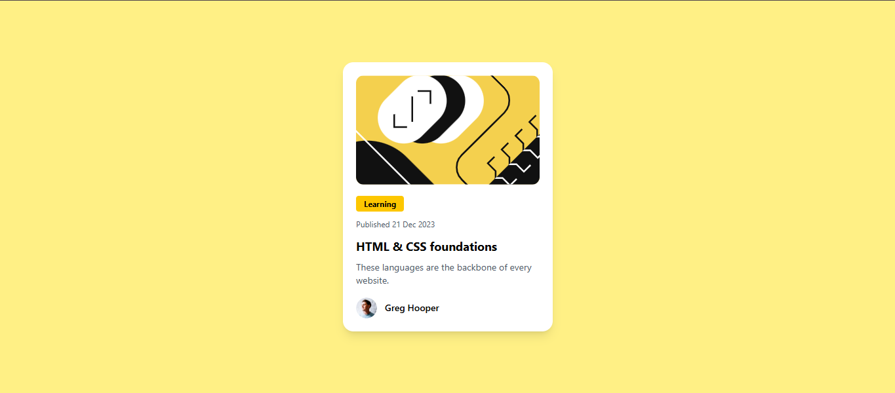

# 📝 Blog Card Component

A clean and responsive **Blog Card Component** built as part of a Frontend Mentor challenge using **React**, **Vite**, and **Tailwind CSS**.

---

## 🚀 Live Demo

🔗 https://codingwithriha.github.io/Blog-card-component/

---

## ✨ Features

* Responsive blog card layout
* Modern UI design
* Built with reusable React components
* Styled using Tailwind CSS

---

## 🛠️ Technologies Used

* React
* Vite
* Tailwind CSS

---

## 📸 Preview



---

## 📂 Project Setup

Clone the repository:

```bash
git clone https://github.com/codingwithriha/Blog-card-component
```

Install dependencies:

```bash
npm install
```

Run locally:

```bash
npm run dev
```

Build for production:

```bash
npm run build
```

---

## 🎯 Challenge

This project was created as a solution to a Frontend Mentor challenge.

🔗 https://www.frontendmentor.io/

---

## 👩‍💻 Author

**Riha Shehzadi** <br>
GitHub: https://github.com/codingwithriha
